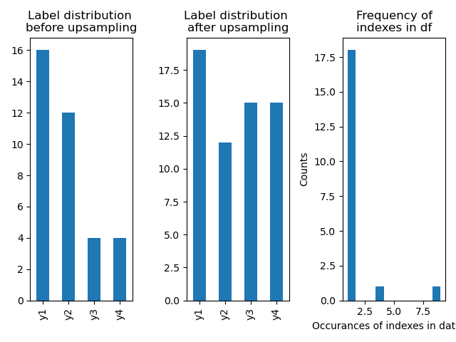

# Multilabel Oversampling

**Many algorithms for imbalanced data support binary and multiclass classification only.**
**This approach is made for multi-label classification (aka multi-target classification).**


## :slot_machine: Algorithm

* Multilabel dataset (as `pandas.DataFrame`) with imbalanced data
* Calculate counts per class and then calculate the standard deviation (std) of the count values
* Do for `number_of_adds` times the following: 
* Randomly draw a sample from your data and calculate new std  
	* If new std reduces, add sample to your dataset
	* If not, draw another sample (to this up to `number_of_tries` times)
* A new df is returned. 
* A result plot visualizes the target distribution before and after upsampling. Moreover the counts per index are shown.

## :arrow_right: Usage

```python
from multilabel_oversampling import multilabel_oversampling as mo

df = mo.create_fake_data(size=1, seed=3)
ml_oversampler = mo.MultilabelOversampler(number_of_adds=100, number_of_tries=100)
df_new, plot_at = ml_oversampler.fit(df)
#> Iteration:  20%|██████                        | 20/100 [00:00<00:00, 111.68it/s]
#> No improvement after 100 tries in iter 20.
```


```python
ml_oversampler.plot_results()
```



```python
#import seaborn as sns
#df.style.background_gradient(cmap=sns.color_palette("Spectral", as_cmap=True))

# Original DataFrame
print(df)
#>     y1  y2  y3  y4           x
#> 0    1   1   0   0   img_0.jpg
#> 1    1   1   1   0   img_1.jpg
#> 2    1   1   1   0   img_2.jpg
#> 3    1   1   0   0   img_3.jpg
#> 4    1   1   0   0   img_4.jpg
#> 5    1   1   0   1   img_5.jpg
#> 6    1   1   0   0   img_6.jpg
#> 7    1   1   0   0   img_7.jpg
#> 8    1   1   0   0   img_8.jpg
#> 9    1   1   0   0   img_9.jpg
#> 10   1   1   0   0  img_10.jpg
#> 11   1   1   0   0  img_11.jpg
#> 12   1   0   0   1  img_12.jpg
#> 13   1   0   0   1  img_13.jpg
#> 14   1   0   0   0  img_14.jpg
#> 15   1   0   0   0  img_15.jpg
#> 16   0   0   1   0  img_16.jpg
#> 17   0   0   0   1  img_17.jpg
#> 18   0   0   1   0  img_18.jpg
#> 19   0   0   0   0  img_19.jpg

# New DataFrame after upsampling
print(df_new)
#>     y1  y2  y3  y4           x
#> 0    1   1   0   0   img_0.jpg
#> 1    1   1   1   0   img_1.jpg
#> 2    1   1   1   0   img_2.jpg
#> 3    1   1   0   0   img_3.jpg
#> 4    1   1   0   0   img_4.jpg
#> 5    1   1   0   1   img_5.jpg
#> 6    1   1   0   0   img_6.jpg
#> 7    1   1   0   0   img_7.jpg
#> 8    1   1   0   0   img_8.jpg
#> 9    1   1   0   0   img_9.jpg
#> 10   1   1   0   0  img_10.jpg
#> 11   1   1   0   0  img_11.jpg
#> 12   1   0   0   1  img_12.jpg
#> 13   1   0   0   1  img_13.jpg
#> 14   1   0   0   0  img_14.jpg
#> 15   1   0   0   0  img_15.jpg
#> 16   0   0   1   0  img_16.jpg
#> 17   0   0   0   1  img_17.jpg
#> 18   0   0   1   0  img_18.jpg
#> 19   0   0   0   0  img_19.jpg
#> 17   0   0   0   1  img_17.jpg
#> 16   0   0   1   0  img_16.jpg
#> 16   0   0   1   0  img_16.jpg
#> 16   0   0   1   0  img_16.jpg
#> 16   0   0   1   0  img_16.jpg
#> 16   0   0   1   0  img_16.jpg
#> 16   0   0   1   0  img_16.jpg
#> 18   0   0   1   0  img_18.jpg
#> 13   1   0   0   1  img_13.jpg
#> 18   0   0   1   0  img_18.jpg
#> 17   0   0   0   1  img_17.jpg
#> 17   0   0   0   1  img_17.jpg
#> 17   0   0   0   1  img_17.jpg
#> 16   0   0   1   0  img_16.jpg
#> 17   0   0   0   1  img_17.jpg
#> 17   0   0   0   1  img_17.jpg
#> 17   0   0   0   1  img_17.jpg
#> 16   0   0   1   0  img_16.jpg
#> 17   0   0   0   1  img_17.jpg
#> 17   0   0   0   1  img_17.jpg

```


## :information_source: Install

* Install from GitHub

```bash
pip install git+https://github.com/phiyodr/multilabel-oversampling
```

:sunflower: